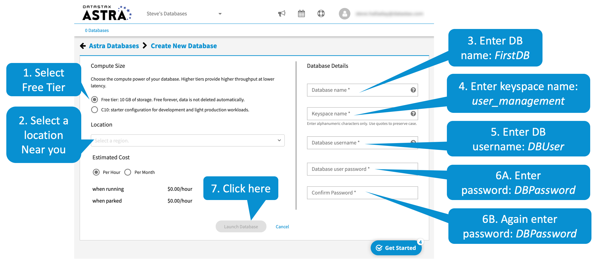
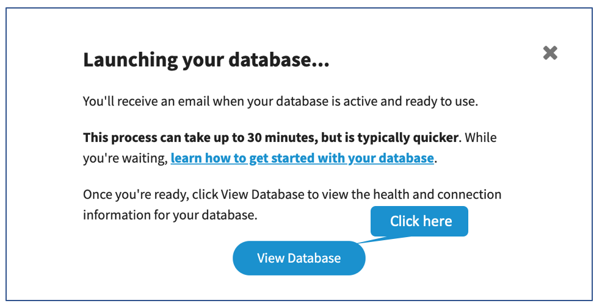
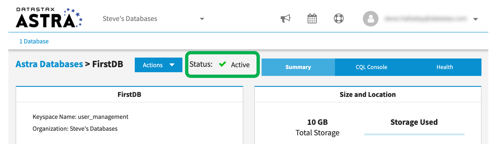

If you don't have an Astra account, set one up - it's easy.

Go to the Astra page in your browser [astra.datastax.com](http://astra.datastax.com).

Let's create the database.
In the Astra page, follow the steps outlined here.
To make life easy, we have recommended the values you should use for this scenario in _Italics_.

On this dialog, click _View Database_.

When you see the active status on this page, your database is ready to go.

 
## Congratulations! You have an active Cassandra database!
