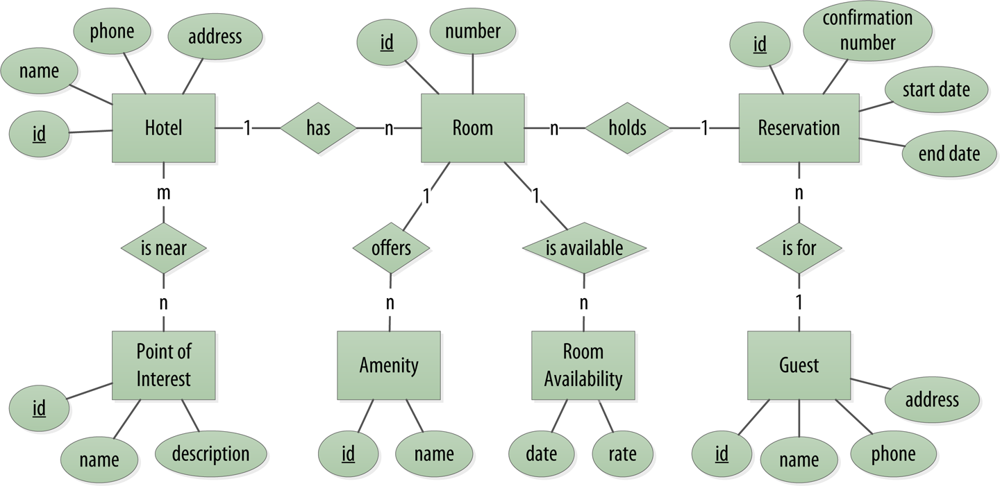

# Designing Cassandra Tables

This scenario is based on "Chapter 5: Cassandra Data Modeling" from the O'Reilly book "Cassandra: The Definitive Guide, 3rd Edition" by Jeff Carpenter and Eben Hewitt.

In this scenario, we'll look at the recommended best practices for Cassandra data modeling, starting with identifying tables based on application access patterns. 

Let's use a domain that is easily understood and that everyone can relate to: making hotel reservations. Here's a conceptual model for the domain:

