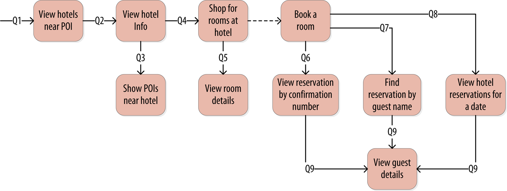

# Identifying Access Patterns

When designing Cassandra data models, you start with the query model. In contrast to relational data modeling, where you model the data first and then write queries, with Cassandra you model the queries and let the data be organized around them. 

Think of the most common query paths your application will use, and then create the tables that you need to support them. The user interface design for the application is often a great artifact to use to begin identifying queries.

For example, examine the queries in the context of the workflow of a hotel reservation shown below. Each box on the diagram represents a step in the application workflow, with arrows indicating the flows between steps and the associated query. 

Notice how each step of the workflow accomplishes a task that &ldquo;unlocks&rdquo; subsequent steps. For example, the &ldquo;View hotels near POI&rdquo; task helps the application learn about several hotels, including their unique keys. The key for a selected hotel may be used as part of Q2, in order to obtain a detailed description of the hotel.

In the following steps you'll examine the design of tables supporting the queries in the diagram.

