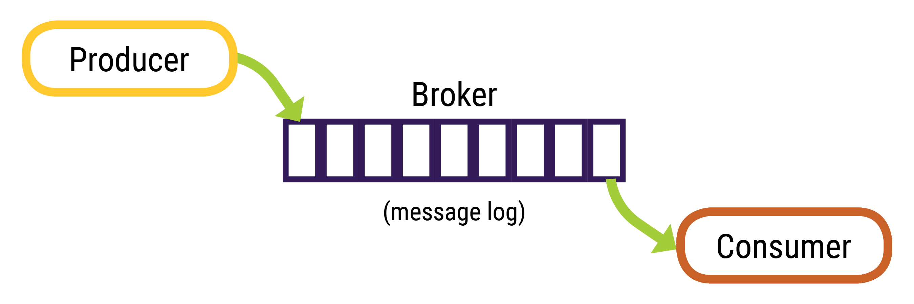

Apache Kafka™ is a distributed streaming message queue. Producers publish messages to a topic, the broker(or Kafka server) stores them in the order received, and consumers (DataStax Connector) subscribe and read messages from the topic.

Wait for DSE to finsih starting up, or start working in a new tab by clicking the plus on the dashboard: 

Download the Apache Kafka tarball:
`wget http://apache.spinellicreations.com/kafka/2.2.2/kafka_2.11-2.2.2.tgz`{{execute}}

Create a directory for the Kafka installation:
`mkdir kafka`{{execute}}

Unpack the tarball into the `kafka` directory:
`tar -xzf kafka_2.11-2.2.2.tgz -C kafka --strip-components=1`{{execute}}

Download the Datastax Kafka Connector:
`wget https://downloads.datastax.com/kafka/kafka-connect-dse.tar.gz`{{execute}}

Creat the kafka-connect directory:
`mkdir kafka-connect`{{execute}}

Unpack the connector:
`tar -xzf kafka-connect-dse.tar.gz -C kafka-connect --strip-components=1`{{execute}}
