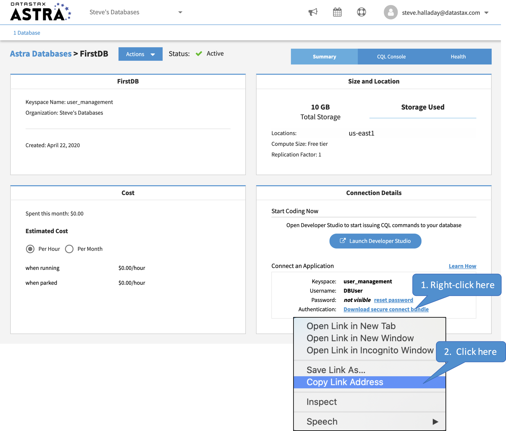
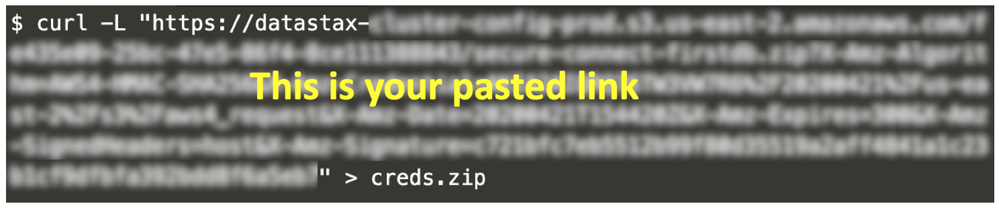

Let's download `cqlsh` and configure it to work with your Astra database.
Here's the command to download and unpack `cqlsh`.

`wget https://downloads.datastax.com/enterprise/cqlsh-astra.tar.gz
tar xvzf cqlsh-astra.tar.gz`{{execute}}

Let's add `cqlsh` to our path.

`export PATH=$PATH:/root/cqlsh-astra/bin`{{execute}}

We want to have a secure connection between `cqlsh` and our Astra database.
We'll set that up here.

Astra provides a secure connection bundle you will want to download.
Here's the command, but notice you will need to replace _<paste link here>_ with a link to the secure bundle.
Copy this command and paste it in the terminal window, but DO NOT EXECUTE THE COMMAND YET!!!!!!

`curl -L "<paste link here>" > creds.zip`{{copy}}

You can find the link on the Astra page by following the steps shown below.
Note that this link is time-sensitive, so you need to complete the next couple of steps without delay.

Now, go back to the terminal tab.
You will need to paste the link (the one you just copied) into the `curl` command as indicated - be sure to include the double quotes.
The curl command with the link will look something like this.

Once you have pasted the link, execute the `curl` command.

Finally, you can start the CQL shell with the following command.
You will be prompted for the necessary password.
If you followed our instructions when you created the database, the password is `DBPassword`{{copy}}.

`cqlsh --secure-connect-bundle=creds.zip -u DBUser`{{execute}}

## Outstanding! You are connected to Astra!
